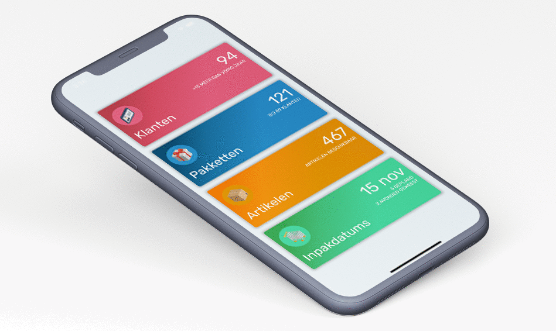

# 🎁 Flutter Christmas Packages App

A Flutter app based on a webapplication I made for a customer. My idea here is they can access the same data as in the webapplication just in a native app, made with Flutter :).

The purpose of this repo is to share the base of the app I made so far, so you can take advantage of it.

I have mainly focused on two parts now:
1. The design and pages
2. The (re)usalbility of the Drawer, Appbar and the Bottomnavigationbar*. I only made one drawer, appbar and bottomnavigation, which can be used through the whole app.

## Getting Started 🚀

```shell
- Clone the repo
- Install the dependicies
- Run it
```

## Preview and Google Play



[](https://play.google.com/store/apps/details?id=com.interestinate.flutter_package_manager_)

## Version history

| Version |       Date         |             Comments             |
| ------- | ------------------ | -------------------------------- |
| 1.0     | ~October 2019    | Initial release                  |

## Contributing

Feel welcome and free to submit issues, pull requests and features to this repo.

## Support me

I really like to make as much (free) beautiful Flutter apps, so you get inspired!
Hence you can support me by:

⭐️ this repo if you like it.

[](https://paypal.me/jwalhout?locale.x=nl_NL)

Thank you in advanced 👍

## Other Flutter Apps

There are other example Apps made with flutter, see more on [Interestinate](https://interestinate.com).

